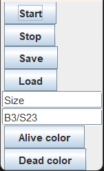
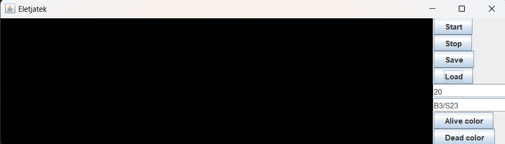
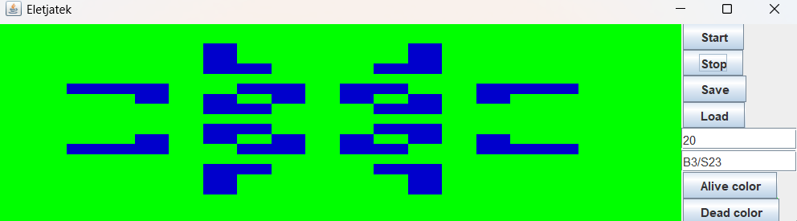

# Életjáték

Java nyelven megírt Életjáték (Conway's Game of Life) alkalmazás.

## Főbb funkciók:

### Pálya méretének megadása
A játék indítása előtt megadható a pálya szélessége és magassága, így tetszőleges méretű világot lehet létrehozni.

### Szabály megadása
A klasszikus szabályok mellett lehetőség van egyedi szabályok megadására is. A felhasználó meghatározhatja:
- hány szomszéd élő sejt szükséges az adott sejt életben maradásához,
- hány szomszéd élő sejt szükséges egy új sejt születéséhez.

### Interaktív vezérlés
- A játék kezdetén manuálisan is beállítható az induló sejtek állapota (élő vagy halott).
- A játék futása közben szüneteltethető, újraindítható.

### Színek testreszabása
Lehetőség van az élő sejtek színének kiválasztására, így a megjelenés személyre szabható.

### Fájlba mentés és betöltés
- **Mentés fájlba**: az aktuális pályaállapot és szabályok elmenthetők egy fájlba, hogy később folytatható legyen a játék.
- **Betöltés fájlból**: korábban elmentett állapot könnyen visszatölthető, így nem kell minden alkalommal újra beállítani a pályát.

### Vizualizáció
- A pálya grafikus felületen jelenik meg.
- Élő sejtek színes négyzetként jelennek meg, míg a halott sejtek háttérszínűek.
- A generációk váltása animációval történik, így könnyen követhető a sejtek változása.

### Képek
Az alábbi képek bemutatják az alkalmazás működését különböző pályaméretekkel és szabálybeállításokkal:

**Főmenü**


**Pálya kezdeti állapota**


**Futó játék**


## Futás
A projekt futtatásához szükség van:
- Java 17 vagy újabb verzióra
- IDE-re (pl. IntelliJ IDEA, Eclipse) vagy parancssori futtatásra

Futtatás lépései:
```bash
javac Main.java
java Main
```